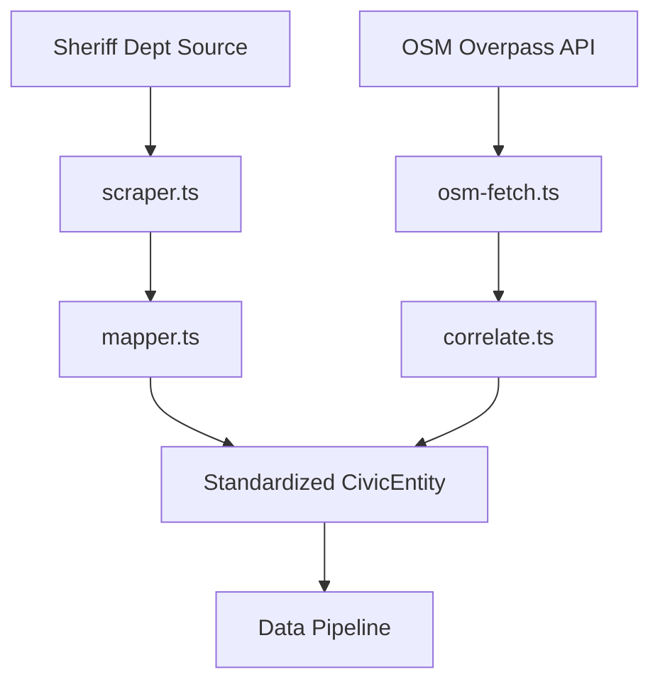

# Putnam County Sheriff's Office Connector (gov-data)

## Purpose
Processes Putnam County Sheriff's Department records and OpenStreetMap location data to build a unified civic data pipeline. Automates extraction of press releases, incident reports, and court filings while verifying geographic boundaries through OSM correlation.

## Architecture Overview


## File Structure
```
/lib/connectors/gov-data/
├── config.json          # Connection configuration & endpoint definitions
├── index.ts             # Import/export points
├── mapper.ts            # Data transformation layer
└── osm/                 # OpenStreetMap integration
    ├── osm-fetch.ts     # Overpass API fetcher with retry logic
    ├── correlate.ts     # Geospatial boundary correlation logic
    └── test-osm-correlation.ts # Validation test suite
```

## Configuration
```json
{
  "name": "gov-data",
  "version": "1.0.0",
  "description": "Putnam County Government Data Connector (Sheriff's Dept, Emergency Management, Court Records)",
  "baseUrl": "https://putnamcountytn.gov",
  "endpoints": {
    "pressReleases": "/emergency-management/press-releases",
    "incidentReports": "/emergency-management/incident-reports",
    "courtFilingLinks": "/emergency-management/court-filing-links"
  },
  "scrapingSchedule": "daily",
  "dataCategories": [
    "incident_report",
    "press_release",
    "court_document",
    "public_notice"
  ]
}
```

## Key Features
- **Mirror System**: Automatic fallback to alternative endpoints
- **Exponential Backoff**: Adaptive retry delays for rate limiting
- **Geospatial Validation**: Boundary correlation with OSM polygons
- **Error Resilience**: Structured exception handling with logging
- **Data Standardization**: Uniform CivicEntity schema output

## Critical Features
| Feature | Benefit |
|---------|---------|
| **Boundary Verification** | Confirms addresses are within Putnam County limits |
| **Press Release Parsing** | Extracts title, date, content, document links |
| **Incident Reporting** | Structures emergency data with severity metadata |
| **Court Document Extraction** | Retrieves filing details for legal tracking |
| **Reliability Engineering** | Auto-retry on failures with backoff strategy |
| **Location Validation** | Confirms coordinates match official parcel polygons |

## Integration
Registered in `/lib/pipeline/data-pipeline.ts` for concurrent execution with other civic data sources. Outputs standardized `CivicEntity[]` arrays ready for analytics workflows.

## Validation
Run correlation tests:
```bash
npx ts-node --esm lib/connectors/gov-data/osm/test-osm-correlation.ts
```

## Extensibility
New features should:
1. Maintain backward compatibility with existing schema
2. Follow established retry/pagination patterns
3. Preserve existing configuration structures
4. Add corresponding test cases